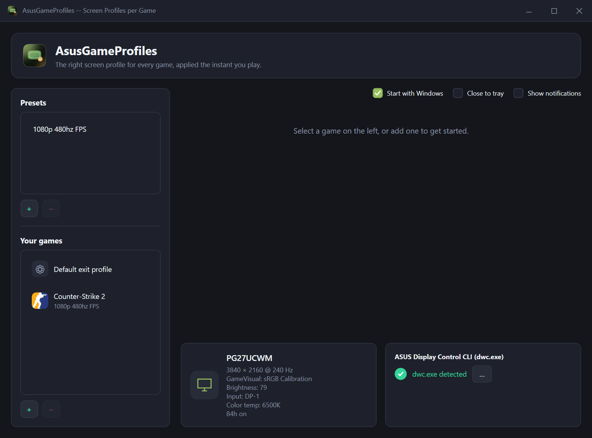
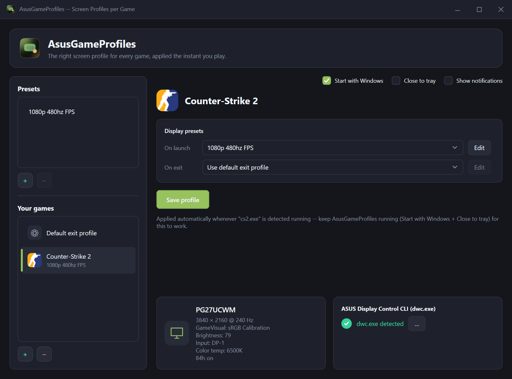

# AsusGameProfiles

Automatically switches your ASUS monitor's display profile when a game launches or closes.

AsusGameProfiles watches for the games you play and applies the right monitor settings
(GameVisual mode, Frame Rate Boost, brightness, color temperature, and more) the moment they
launch, then restores your preferred profile the moment they close. Define a preset once, assign
it to as many games as you like, and stop digging through your monitor's OSD menu mid-session.

Built on ASUS's official [Display Control CLI](https://github.com/ASUS-Display/asus-display-control)
(`dwc.exe`), so it requires a monitor `dwc.exe` supports. **This project is not affiliated with,
endorsed by, or sponsored by ASUS.**

## Requirements

- Windows 10 (1809+) or Windows 11, x64.
- An ASUS monitor supported by `dwc.exe` (ASUS Display Control's own CLI; if
  [DisplayWidget Center](https://www.asus.com/support/faq/1046858/)'s "App Tweaker" already works
  with your monitor, this will too).
- [.NET 8 Desktop Runtime](https://dotnet.microsoft.com/download/dotnet/8.0): the installer will
  prompt for it if it's missing.
- `dwc.exe` itself: point the app at an existing install, or use the in-app "Install dwc.exe"
  button, which downloads it directly from ASUS's official repository and verifies its SHA256
  checksum before installing it.

## Install

Download the latest `AsusGameProfiles-Setup.msi` from the
[Releases page](https://github.com/jffz/AsusGameProfiles/releases) and run it.

Package manager installs (Chocolatey, Winget) are in progress, see
[Known limitations](#known-limitations).

## Quick start

1. Launch AsusGameProfiles. If `dwc.exe` isn't detected automatically, either browse to it manually
   or click "Install dwc.exe" to download it.
2. Create a **preset**: a reusable display state (GameVisual mode, Frame Rate Boost, and any
   advanced `dwc.exe` properties you want to set).
3. Add a **game**, from your Steam library, or manually by pointing at any `.exe`.
4. Select the game, assign your preset **On launch**, and optionally a different preset (or the
   global default) **On exit**.

   

5. Enable **Start with Windows** and **Close to tray**. Process-watch (the mechanism that detects
   when a game starts or stops) only works while AsusGameProfiles is running, so these two settings
   are what make the whole thing actually happen automatically instead of only when you remember to
   open the app first.

That's it: launch the game normally (Steam, a shortcut, whatever you already use) and the profile
switches on its own.

## How it works

AsusGameProfiles polls running processes every couple of seconds and compares them against the
games you've added. When a match starts, it applies that game's "on launch" preset; when it stops,
it applies the "on exit" preset (or, if none is set, a global "Default exit profile" you configure
once). This works identically for Steam and non-Steam games: there's no special Steam integration
to configure, no launch options to edit.

This app runs entirely in user space: no administrator rights, no kernel driver, no background
Windows service. It's just a normal app with a system tray icon, and it only affects your monitor
(via `dwc.exe`); it never touches a game's process, memory, or files.

## Is this safe? (VAC / anti-cheat)

Short answer: yes. This has nothing in common with what anti-cheat systems (VAC, FACEIT, etc.)
actually monitor.

VAC and FACEIT watch for things that touch the *protected game process* directly: code injection,
memory reads/writes, render-pipeline hooking (DirectX/OpenGL), or suspicious kernel drivers.
AsusGameProfiles does none of that. It's a completely separate process that (1) notices your
game's process is running via the normal Windows process list, exactly like Task Manager does, and
(2) talks to your *monitor*, not the game, over DDC/CI through `dwc.exe`. It never opens a handle
to the game's process, never reads its memory, never hooks its rendering.

This is, in fact, the same fundamental mechanism ASUS's own **DisplayWidget Center "App Tweaker"**
uses: software preinstalled on millions of gaming PCs, including plenty of people who play
competitively every day. If external process detection alone triggered anti-cheat action, Discord,
MSI Afterburner/RTSS, GeForce Experience, and DisplayWidget Center itself would all have been
flagged years ago.

(An earlier version of this app briefly used a different mechanism: wrapping a game's Steam launch
command, specifically because that approach *did* cause problems with FACEIT, which refuses to run
when a launch command looks wrapped. That mechanism was removed; process-watch, described above, is
the only mechanism this app uses today.)

## Troubleshooting

- **"dwc.exe not found"**: browse to it manually if you already have DisplayWidget Center
  installed, or use "Install dwc.exe" to download the official CLI automatically.
- **"No monitor detected"**: check the cable/connection, and confirm your monitor model is one
  `dwc.exe` supports (not every ASUS monitor exposes DDC/CI control).
- **Nothing happens when I launch a game**: confirm the game has a preset assigned "On launch"
  (the app warns you if it doesn't), and that **Start with Windows** + **Close to tray** are both
  enabled so the app is actually running and watching.
- **Steam won't let me save launch-related settings**: not applicable anymore, this app no longer
  writes Steam launch options (see [How it works](#how-it-works)).

## Known limitations

- **ASUS monitors only.** This is a limitation of `dwc.exe` itself, not something this app can work
  around.
- **Single monitor targeting.** If you have more than one ASUS monitor connected, `dwc.exe` commands
  currently apply without picking a specific target; multi-monitor selection is planned but not
  built yet.
- **No auto-update.** New versions need to be downloaded and reinstalled manually for now.
- **Unsigned installer.** Windows SmartScreen may warn on first install. This project uses (or is
  applying to use) the [SignPath Foundation](https://signpath.org/)'s free code signing program for
  open-source software; releases will be signed once that's set up.
- **Package managers.** Chocolatey and Winget packaging is in progress; MSI-from-Releases is the
  supported install path for now.

## Contributing

See [CONTRIBUTING.md](CONTRIBUTING.md) for build instructions and how to submit changes.

## License

Apache License 2.0, see [LICENSE](LICENSE) and [NOTICE](NOTICE).

"ASUS" is a trademark of ASUSTeK Computer Inc. This project is an independent, community-developed
tool and is not affiliated with, endorsed by, or sponsored by ASUS.
